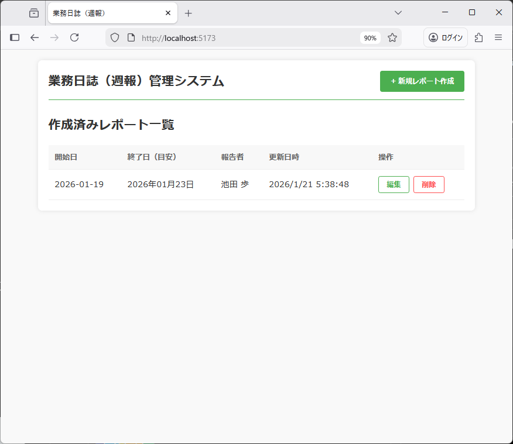
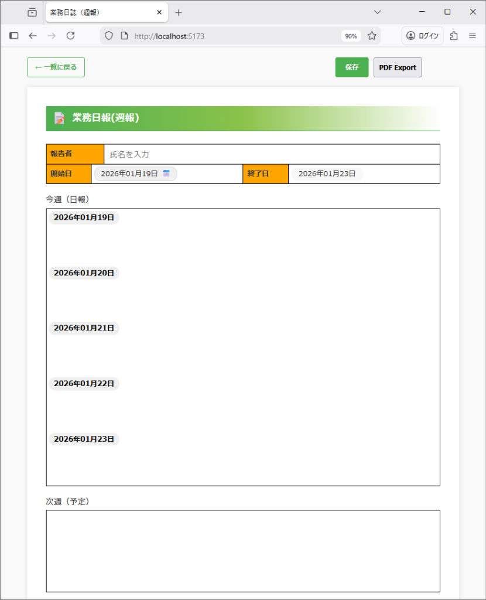

# 業務日誌（週報）作成システム

このプロジェクトは、月曜から金曜までの業務内容を記録し、指定のPDFフォーマットで出力するためのWebアプリケーションです。 SQLite3をバックエンドに使用し、複数の週報を管理できます。

## 機能概要

- **管理画面（ダッシュボード）**: 作成済みのレポート一覧表示、編集、新規作成。
- **自動日付計算**: 開始日を入力すると、対応する金曜日までを自動的にセット。
- **日報統合**: 「前日と同じ」を選択することで、複数の日程を1つの入力欄に集約可能。
- **祝日対応**: 各日を「祝祭日」に切り替え可能。
- **永続化**: 入力内容はサーバー側の SQLite3 データベースに保存。
- **リッチテキスト編集**: 太字、斜体、下線、取り消し線、リスト、文字色/背景色の装飾が可能。
- **PDF出力**: A4サイズの指定フォーマットでPDFを生成。

## 画面イメージ

### ダッシュボード

作成済みのレポートが一覧表示されます。新規作成や、既存レポートの編集・削除が行えます。



### 編集画面

日々の業務内容を入力します。日付ラベルをクリックすることで、統合や祝日設定が可能です。
入力欄はリッチテキストエディタになっており、文字の強調やリスト作成など、見やすいレイアウトで記述できます。



## セットアップ

### 必要条件

- Node.js (v20.19.0以上 または v22.12.0以上 推奨)
- sqlite3 (CLIツール、直接アクセスする場合に必要)

### インストール

```bash
npm install
```

### 開発用サーバーの起動 (フロントエンド & バックエンド)

```bash
npm run dev:all
```

※ フロントエンド（Vite）とバックエンド（Express）が同時に起動します。

---

## デスクトップアプリケーション (Electron)

このシステムは Electron を使用して、デスクトップアプリとしてビルド・使用することが可能です。

### デスクトップ版の起動 (開発モード)

```bash
npm run electron:dev
```

### パッケージ化 (ビルド)

各OS用の実行ファイルを生成します。成果物は `release/` フォルダに出力されます。

#### Windows 用 (インストーラー)

Windows環境の PowerShell で実行してください。

```powershell
npm run electron:build
```

※ `DailyReportSystem-Setup-1.0.0.exe` が生成されます。

#### Linux 用 (AppImage)

```bash
npm run electron:build
```

※ `DailyReportSystem-1.0.0.AppImage` が生成されます。

> [!TIP]
> Linux環境で実行時にサンドボックス関連のエラー（`FATAL:setuid_sandbox_host.cc` など）が出る場合は、以下のオプションを付けて実行してください：
>
> ```bash
> ./DailyReportSystem-1.0.0.AppImage --no-sandbox
> ```

---

## 技術資料

### データベース仕様

バックエンドでは `sqlite3` を使用しています。

#### 保存場所

- **Web開発時**: `server/database.sqlite`
- **デスクトップアプリ実行時**: ユーザーデータディレクトリに自動的に保存されます。
  - **Windows**: `%APPDATA%/DailyReportSystem/database.sqlite`
  - **Linux**: `~/.config/DailyReportSystem/database.sqlite`

#### テーブル定義: `reports`

| カラム名 | 型 | 説明 |
| :--- | :--- | :--- |
| id | INTEGER | プライマリキー、自動増分 |
| reporterName | TEXT | 報告者の氏名 |
| startDate | TEXT | レポートの開始日 (YYYY-MM-DD)、ユニーク制約 |
| entries | TEXT | 各日のデータ (JSON文字列) |
| nextWeekPlan | TEXT | 次週の予定 (フリーテキスト) |
| updatedAt | DATETIME | 最終更新日時 |

#### データベースへの直接アクセス方法

ターミナルから `sqlite3` コマンドを使用して直接データを確認できます。

```bash
# データベースを開く
sqlite3 server/database.sqlite

# カラム名を表示する設定
sqlite> .header on
sqlite> .mode columns

# データを確認する
sqlite> SELECT id, reporterName, startDate FROM reports;

# 終了
sqlite> .exit
```

## プロジェクト構造

- `src/`: フロントエンド (React)
- `server/`: バックエンド (Express + SQLite3)
- `server/database.sqlite`: データベースファイル
